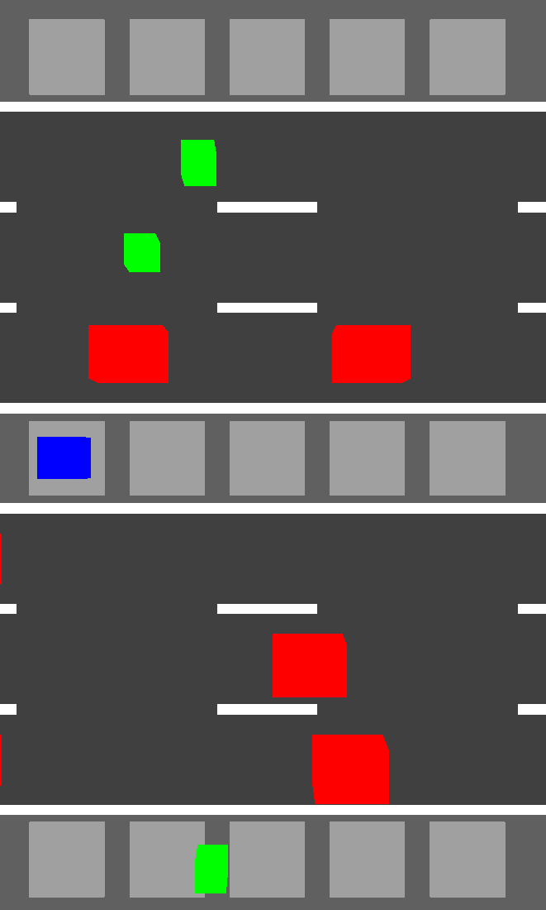

French Frogger
==============

My submission for Ludum Dare 52.

- **WASD** - Move

In this game, you play a chef who is _harvesting_ roadkill for his kitchen. But since we're in France, these are _cuisses de grenouille_, also known as frog legs! Touching either the red cars or the green frogs will kill you. When a frog gets hit by a car and turns beige, it becomes collectible. But it will also expire after 10 seconds, so hurry and collect it! A high score will be rewarded with a French title!

The game can be played at most resolutions, but after resizing the page, you need to hit F5 for the new resolution to take effect. WASD is required for movement so mobile is not supported.

I didn't have time until Saturday evening, so this game was basically made in 24 hours, I hope that excuses the lack of polish! :)

Building / Hosting
------------------

The HTML file already contains all the poorly written JavaScript needed for this project, so unlike with TypeScript projects, there is no build step.

The repo only has the `gh-pages` branch, this is done so GitHub hosts this project here:

- https://xjcl.github.io/ld52_french_frogger/index.html
